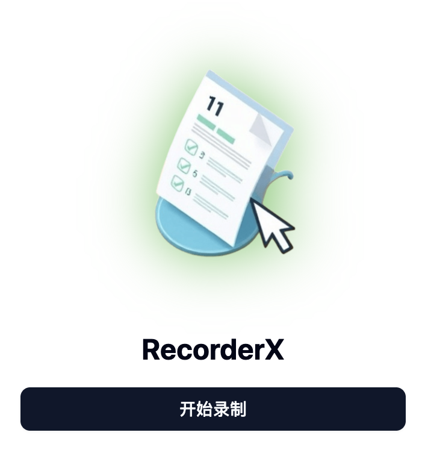

# Recorder X

[English](README.md#english) | [中文](#chinese)

Recorder X 是一个功能强大的浏览器扩展，用于记录和管理网页操作。它可以帮助您轻松捕获、组织和分享浏览活动。



## 功能特点

- 🎥 **屏幕录制**：高质量捕获网页操作
- 📝 **智能组织**：自动按标题和时间戳组织录制内容
- 🖼️ **截图支持**：录制过程中可以进行截图和标注
- 📤 **导出选项**：将录制内容导出为 Word 文档或 PDF 文件
- 🔄 **状态管理**：随时暂停、恢复和停止录制
- 📱 **响应式设计**：完美支持桌面和移动设备

## 安装说明

1. 克隆仓库：
```bash
git clone https://github.com/yourusername/recorder-x.git
cd recorder-x
```

2. 安装依赖：
```bash
pnpm install
```

3. 构建扩展：
```bash
pnpm build
```

4. 在浏览器中加载扩展：
- 打开 Chrome/Edge 并导航到扩展页面
- 启用开发者模式
- 点击"加载已解压的扩展程序"并选择 `dist` 目录

## 使用方法

1. 点击扩展图标打开侧边面板
2. 点击"开始录制"开始捕获
3. 执行您想要记录的操作
4. 使用控制按钮暂停/恢复/停止录制
5. 将录制内容导出为 Word 或 PDF

## 开发指南

```bash
# 启动开发服务器
pnpm dev

# 构建生产版本
pnpm build
```
